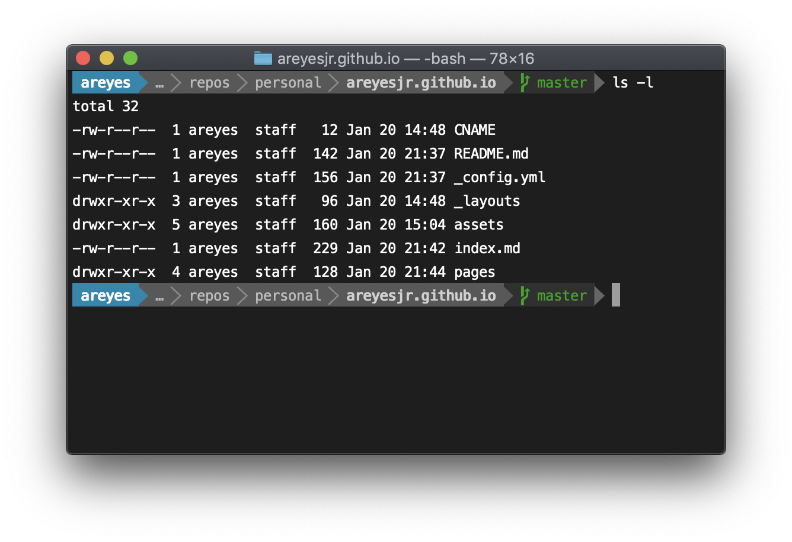

# Install powerline the easy way

Powerline is a beautiful status line for vim, git, bash and more. If you are constantly creating branches and working on the commandline this tool is great for you. Powerline is full of features and has become one of my most important tools.

Once installed this is how it looks. 

Notice how status line identifies that I am on the [master](https://git-scm.com/book/en/v1/Git-Branching-What-a-Branch-Is) branch.

[back](../)
