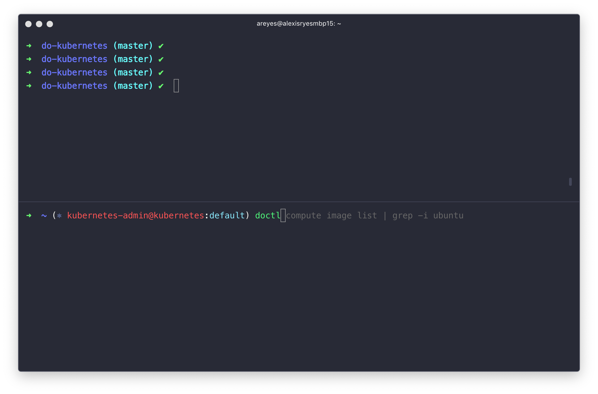

### Shell



I am a big fan of the Dracula Theme and I use their color schemes for everything!
Credit goes to that awesome community. You can find them [HERE](https://draculatheme.com/).

I use the Dracula Theme on everything:
*   VSCode
*   Slack
*   Hyper
*   Github Pages

#### [](#header-4)How to get your terminal to look like mine. 

We its really simple. 

1. Download and install [Hyper](https://hyper.is/).

2. Install the dracula theme by running ```hyper install hyper-dracula``` in Hyper. 

3. Run the following command to change shells and use zsh.
```sh -c "$(curl -fsSL https://raw.githubusercontent.com/robbyrussell/oh-my-zsh/master/tools/install.sh)"```

4. Add the following plugins to your ```~/.zshrc``` config. 

```
...
plugins=(
 docker
 docker-compose
 git
 doctl
 kubectl
 zsh-autosuggestions
 zsh-syntax-highlighting
 helm
 golang
 vscode
 kube-ps1
)
...
```
There are hundreds of plugins to choose from. These are work for me. 
zsh-autosuggestions and zsh-syntax-highlighting do not come by default. 
You can refer to [zsh-users](https://github.com/zsh-users/zsh-autosuggestions/blob/master/INSTALL.md) on installation instructions.

Click here to read more on [oh my zsh](https://github.com/robbyrussell/oh-my-zsh)

[BACK](../)

You can follow me on [twitter](https://twitter.com/AlexisReyesJR).
